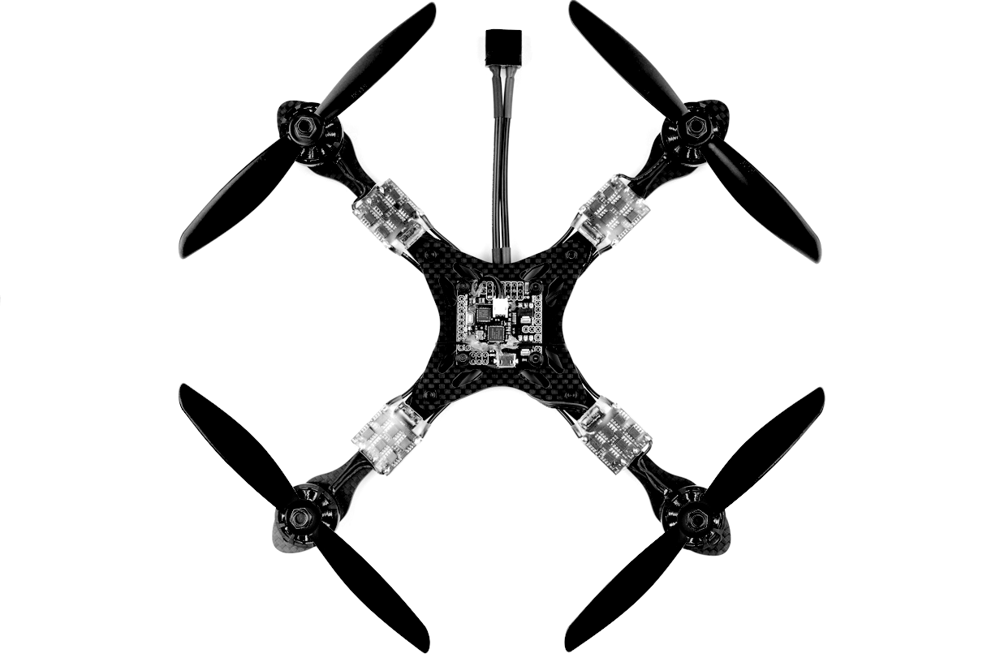
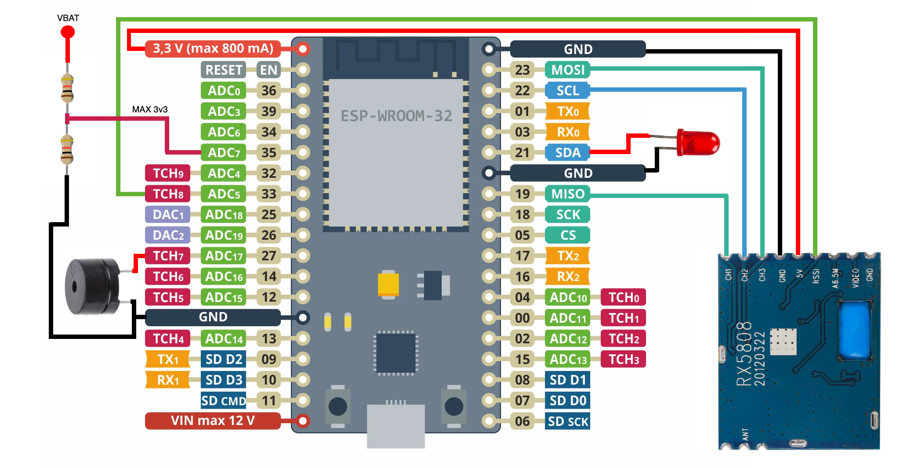
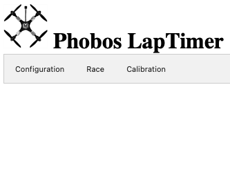
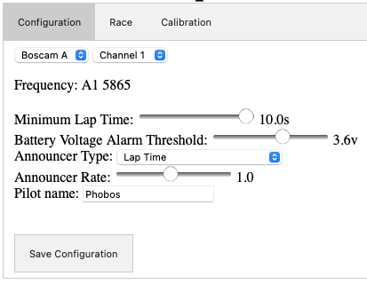
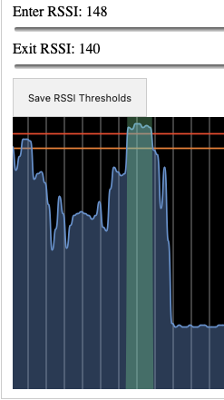

 
# Support PhobosLT
**Affordable FPV single node Race Timing solution**

If you like this project you can support it by contributing to the codebase, testing and giving feedback, sharing new ideas and helping spread the PhobosLT gospel. You can also consider buying me a bubble tea or a beer, it will fuel me to make the project better!

# About

Phobos LapTimer (or PhobosLT) is a simple but mighty lap timing solution for 5.8GHz FPV pilots. It is designed for personal use and with small drones in mind (2 inch or less), but there is nothing against running it with bigger drones! It is a small standalone device that is self powered and communicates over WiFi with a phone, tablet or laptop. The goal of the project is to have a simple to use and small device that can be used anywhere whenever you want to do a whoop race practice session in your living room or at a local training venue with friends with no fuss.
Parts of the code are based on [RotorHazard](https://github.com/RotorHazard/RotorHazard) and [ExpressLRS](https://github.com/ExpressLRS/ExpressLRS). Big kudos to people behind these organizations, they are doing A LOT for the community and are shaping the future of FPV. If you don't know these projects yet and have some time, do check them out!

### Features

PhobosLT has the following features:
- Single node timing of 5.8GHz Analog, HDZero, Walksnail systems.
- Voice callouts, optionally including pilot name.
- Real time RSSI readout and calibration - allows for timing even in small spaces like a 16m^2 or 200 ft^2 room.
- 2 lap consecutive and 3 lap consecutive times and optional readouts on the fly (specially developed for [RaceGOW](https://www.racegow.com/)).
- Viewable lap history.
- Ability to set a minimal measurable lap time to avoid false positives.
- Configurable low voltage alarm.
- Small size, easy to build.
- Relatively cheap.
- No extra apps needed, self sufficient solution.

Future development plans:
- Flashing via WiFi or via web configurator.
- Custom hardware to minimize soldering.
- Integration with ExpressLRS and goggle VRXs to forward lap times to the OSD.
- Integration with RotorHazard to measure split times.
- Supporting multiple pilots at the same time at a cost of lower accuracy.

### How it works

The core of the project is an ESP32 board + an RX5808 module. ESP acts as a web server which serves a simple web page with all the configurations. Any device with WiFi connectivity and a web browser can be used to connect to it, configure the timer and measure lap times.

The lap timing happens by measuring the RSSI over time, filtering it and checking for peaks in the RSSI as the closer the drone is to the timer the higher the RSSI. Based on that we set up an `Enter RSSI` and `Exit RSSI` thresholds, that tell us when to cut a peak. The time between the enter and exit RSSI is then used to measure the time between the last peak and the current peak which is a lap.

Communication with the client happens over WiFi. The ESP32 sets up an access point and the client connects to it. RSSI is transmitted over a websocket to draw the RSSI graph in real time. Configuration, user interactions and events (like starting the timer, stopping, reporting a lap time) are done using rest calls.

The browser is leveraged to emit sounds or call out lap times using [articulate.js](https://github.com/acoti/articulate.js) library, but an optional (but recommended) beeper can be installed to the timer to also emit a sound every time a peak is detected or to alert e.g. when the timer battery voltage is low. 

# How to build one

### Hardware

To build a Phobos LapTimer you will need:
- An ESP32 breakout board, preferably with USB. The codebase is plug and play with `LilyGo T-ENERGY` which has a built in 1s 18650 Li-Ion cell slot and voltage sensing circuit out of the box. Supported boards:
    - LilyGo T-ENERGY - recommended.
    - LilyGo T-CELL - more expensive than the one above but has a charging circuit.
    - ESP32-DevKit - bare bones but cheap.
- An RX5808 VRx module with [SPI mod](https://sheaivey.github.io/rx5808-pro-diversity/docs/rx5808-spi-mod.html).
- A voltage supply of any sort - a battery, a powerbank, etc. It will depend on the ESP32 module used.
- (Optional) An LED of any color (+ a matching resistor to manage current).
- (Optional) A 3v3 to 5v buzzer WITH a generator (so active and not passive).

To connect the RX5808 to the ESP32 use below pinout table. Please note that +5v pin on the RX5808 should be connected to a 3v3 source to undervolt the RX5808 to get a better RSSI resolution and to help with cooling:
| ESP32 PIN | RX5880 |
| :------------- |:-------------|
| 33 | RSSI |
| GND | GND |
| 19 | CH1 |
| 22 | CH2 |
| 23 | CH3 |
| 3V3 | +5V |

Optional but recommended LED, Buzzer and Battery voltage input pinout:
| ESP32 PIN | Peripheral |
| :------------- |:-------------|
| 21 | LED anode (+) |
| 27 | Buzzer positive (+) |
| 35 | VBAT input MAX 3.3v (the code assumes a 1/2 voltage divider with a 1s Li-Ion  cell) |

You can find a connection diagram of the peripherals below. **For T-Energy and T-Cell you just need to connect the RX5808 and a buzzer.**

Alternatively you can ask the community to build a timer for you. Ask around on discord!

### Firmware

Currently building the firmware happens via Visual Studio Code. The toolchain setup is exactly the same as for ExpressLRS, so if you already have an ExpressLRS toolchain set up and running, you should be good. The requirements to build the firmware are as follows:
- Visual Studio Code.
- PlatformIO.
- Git.

#### Toolchain setup

Perform these steps to set the toolchain up on your computer:
1. Download and install [vscode](https://code.visualstudio.com/).
2. Open vscode, and click on the `Extensions` icon in the toolbar on the right (see [Managing Extensions](https://code.visualstudio.com/docs/editor/extension-marketplace)).
3. In the search box, enter platformio, and install the extension (see the `pio install` [documentation](https://platformio.org/install/ide?install=vscode)).
4. Install [git](https://github.com/git-guides/install-git).

The last step before you can build the firmware is to clone this repository to your computer:
- In VSCode open the command palette (using `Cmd+Shift+P` on MacOS or `Ctrl+Shift+P` on Windows)
- Enter `Git: Clone`.
- Click it.
- Then, enter PhobosLT repo URL (can be found on top of the github page under the `Clone` button).
- Choose a folder where you want your copy of the repository to be located.

#### Building

To build the firmware, click the `PlatformIO` icon in the toolbar on the left, which will show the list of tasks. Now, select `Project Tasks`, expand `PhobosLT` -> `General` and select `Build`. You should see the result in the terminal after a few seconds (`Success`).

#### Flashing

Before attemtping to flash ensure there is a connection between the ESP32 and the computer via USB. Flashing is a two step process. First we need to flash the firmware, then the static file system image to the ESP32.

##### Step 1

To flash the firmware, click the `PlatformIO` icon in the toolbar on the left, which will show the list of tasks. Now, select `Project Tasks`, expand `PhobosLT` -> `General` and select `Upload`. You should see the result in the terminal (`Success`). Next, go to step 2.

##### Step 2

Select `Project Tasks`, expand `PhobosLT` -> `Platform` and select `Upload Filesystem Image`. Wait for the result in the terminal saying `Success`. That's it! Your timer is ready to use.

If something went wrong - please check the Terminal, too. It will contain at least a hint of what the issue is. Please ask the community for further help on discord!

# Usage

This section is going to describe the usage and configuration of the timer. The app consists of 3 pages and is very easy to use!

### First connect

1. Turn on the timer, you should hear a short and a long beep.
2. Turn on your device and turn on WiFi.
3. Wait for it to discover a WiFi access point starting with `PhobosLT_xxxx`.
4. Click on it and type the password: `phoboslt`.
5. It should connect and open a browser window with the app for you. If it's not happening, open the browser and type `20.0.0.1`.
6. Voila!

### Configuration

To configure the timer you need to click on the `Configuration` button. You should be greeted with a screen similar to this:

Below you can find all the config parameters and their description:

**Channel and Band** - set to the same Band and Channel as your drone. Supported Bands - A, B, E, Fatshark, RaceBand and LowBand, 8 channel each.
**Frequency** - this is a static field that will display the frequency based on the set Band and Channel.
**Minimum Lap Time** - you can set a minimum lap time that can be timed. This avoids false positives when you crash in the start gate, or when your track is very tight and you fly in close proximity to the timer multiple times during one lap.
**Battery Voltage Alarm Threshold** - sets a battery voltage alarm that will trigger once the desired voltage is reached. The range is between 2.5-4.2v.
**Announcer Type** - you have a few options on how you want your timer to report lap times:
- `None` is no sound at all.
- `Beep` will just emit a short beep on crossing to let you know it registered a lap.
- `Lap Time` will announce the lap time (including your pilot name if the **Pilot name** field is filled).
- `Two Consecutive Lap Time` will announce the two consecutive lap time.
- `Three Consecutive Lap Time` will announce the three consecutive lap time.

**Announcer Rate** - controls the speed of the announcer reading the lap time.
**Pilot Name** - when filled it will include pilot name when reading the times, e.g. `Pilot1 23.45`. It is useful when there is more than just one timer running at the same time. When practicing alone leave it empty.

**NOTE: Once configured make sure to save the configuration by clicking on the `Save Configuration` button, otherwise the changes will not take effect.**

### Calibration

Calibartion is a very important step and it needs to be done properly to ensure the timing happens correctly and every lap is counted by the timer.

To perform the calibration click on the `Calibration` button. You should be presented with two sliders and a graph representing the RSSI over time. You can think of RSSI as an inverse of the distance between the drone and the timer. The higher the RSSI the shorter the distance.

A node can be either `Crossing` or `Clear`. If a node is `Clear`, the timer believes a drone is not near the timer because the RSSI is low. If it is `Crossing`, the timer believes a drone is passing by the timer because the RSSI is high. A lap pass will be recorded once the `Crossing` is finished and the RSSI returns to `Clear` zone. We calibrate that by setting `Enter` and `Exit` RSSI thresholds.

A well calibrated timer will show the lap time when we have only one crossing when drone is the closest to the timer, e.g.:

`Crossing` will always be marked in dark green, while `Clear` will be colored in blue.

To come up with good initial values for `Enter` and `Exit` RSSI perform these steps:
1. Turn on the timer and your drone, set it to the desired VTx power, wait 30 seconds for the VTx to reach its running temperature.
2. Place the drone at a distance of slightly more than one gate above the timer. 
3. Note the RSSI, deduct 2-5 points to be safe - that should be your `Enter RSSI`. 
4. Deduct another 8-10 points and set it as your `Exit RSSI`. 
5. **Click on `Save RSSI Thresholds` - otherwise the changes will not take effect.**

When flying with other pilots the RSSI readings might be lower due to all the noise generated by other VTxs on adjecent channels. A good practice is to lower both thresholds by a few points when flying with other pilots in the air.

### Race and lap management

The Race screen will allow you to start or stop a race and view and clear your lap times. Once clicked on the `Race` button a screen will change to this:

Functions of the buttons:
- `Start Race` - click it to to start the countdown and signal the timer to start counting laps. 
- `Stop Race` - press it when you want to stop counting new laps. It does not clear the laps collected so far.
- `Clear Laps` - clears the laps on the screen, can be done when the race is running as well.

Once you run a few laps the screen will populate with lap times:

# Community

Join our [Discord](https://discord.gg/jvpJppTT) channel for support and questions or just to hang out! Everyone is welcome!
